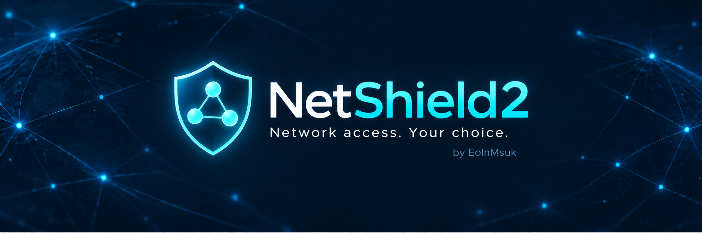

# NetShield2 ⛨

A firewall & live network filter for jailbroken iOS 16 devices (iOS 15, 17 and 18 need testing). NetShield2 uses an OS content filter, saved app rules and actionable notifications. Unlike the original [NetShield](https://github.com/EolnMsuk/NetShield) / [NetFence](https://havoc.app/package/netfence), the new [**NetShield2**](https://github.com/EolnMsuk/NetShield2/) DOES NOT require app injection to function.

## Get started

1. Install the deb from the releases section. No respring is required.
2. Open NetShield and turn on **Firewall** + accept the iOS permissions. Leave **New apps** set to **Ask me** to decide as apps connect. Existing rules are kept when upgrading or toggling the firewall.
3. Enable banners under **Notification settings**. If you use **Do Not Disturb**, allow NetShield in **Settings > Focus > Do Not Disturb > Apps**.
4. When a new app connects, touch and hold its NetShield notification and choose **Allow app** or **Keep blocking**. Tapping the notification body opens NetShield instead where you can also allow or block through prompts.

Unanswered connections are blocked after 30 seconds. You can decide later in **Waiting for your decision**, then retry the app. To ask again for a previously decided app, tap its rule and select **Use new-app setting** while New apps is Ask me.

## Options

- **Firewall:** on/off; turning it off keeps your rules.
- **Allow all iOS system processes:** off by default. When enabled, identities starting with `com.apple.` or `.com.apple.` are allowed without prompting, overriding saved rules. Those rules are preserved and apply again when disabled. Changes affect new connections.
- **New apps:** Ask me, Allow or Block for apps without an explicit rule.
- **App rules:** below Advanced & support, above Recent activity; change saved decisions. Changes apply to new connections; close/reopen an app to end existing connections.
- **Notifications:** notification settings and instructions for banners and Do Not Disturb.
- **Advanced & support:** unidentified connections, manual rules, Copy notification diagnostics, Reset NetShield, Prepare for uninstall, GitHub and donation links.
- **Recent activity:** the latest 20 events from a rolling 300-event record. Data counts arrive when connections close; permission events are not traffic totals.

**Reset NetShield** clears rules, requests and history, restores Ask me and allows unidentified connections, then leaves Firewall off. iOS notification permission is retained.

Before uninstalling, use **Advanced & support > Prepare for uninstall** to remove the system filter. Then uninstall NetShield using your package manager.

## Coverage

Rules apply to new connections delivered by iOS, not every raw packet or OS-exempt path. Unidentified connections have their own rule. Direction rules refer to who initiates a connection, not reply packets. No VPN server entry is needed: this is a content filter, not a VPN tunnel.

## Support the Dev

[GitHub](https://github.com/EolnMsuk/NetShield2/) | [Venmo](https://venmo.com/u/rustonrails) | [BTC](https://www.blockchain.com/explorer/addresses/btc/31uHLpioo1TbxAmo9kM7rrKcLz3wvcoZaL)
